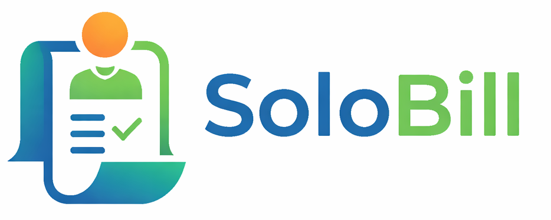
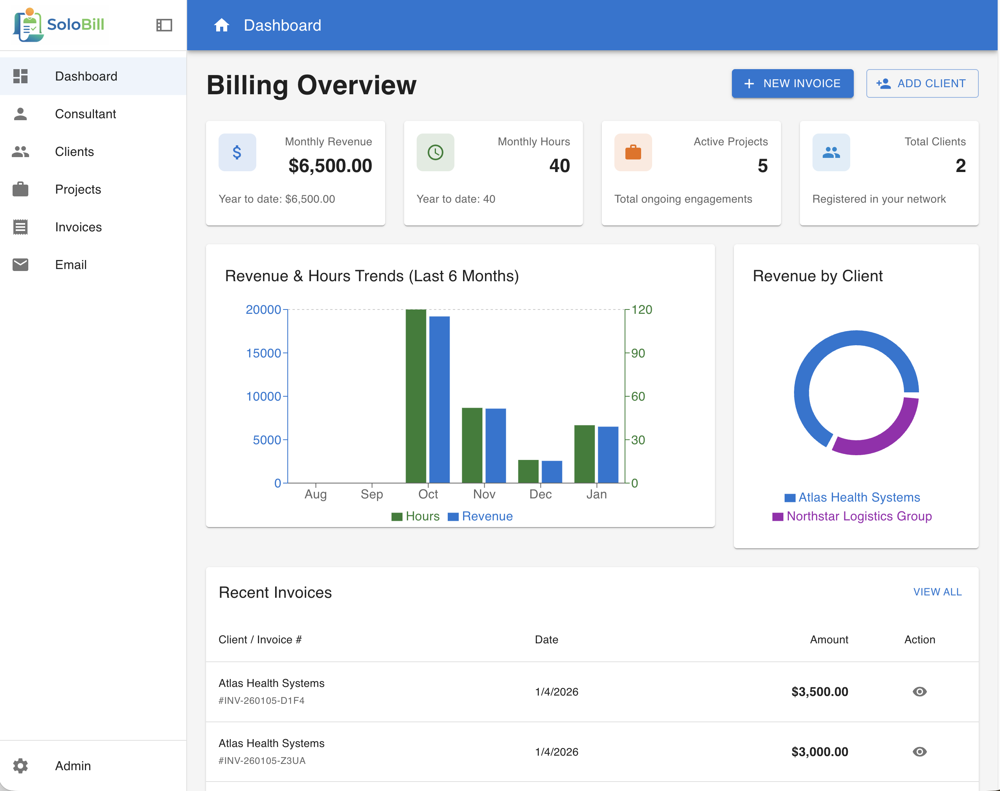
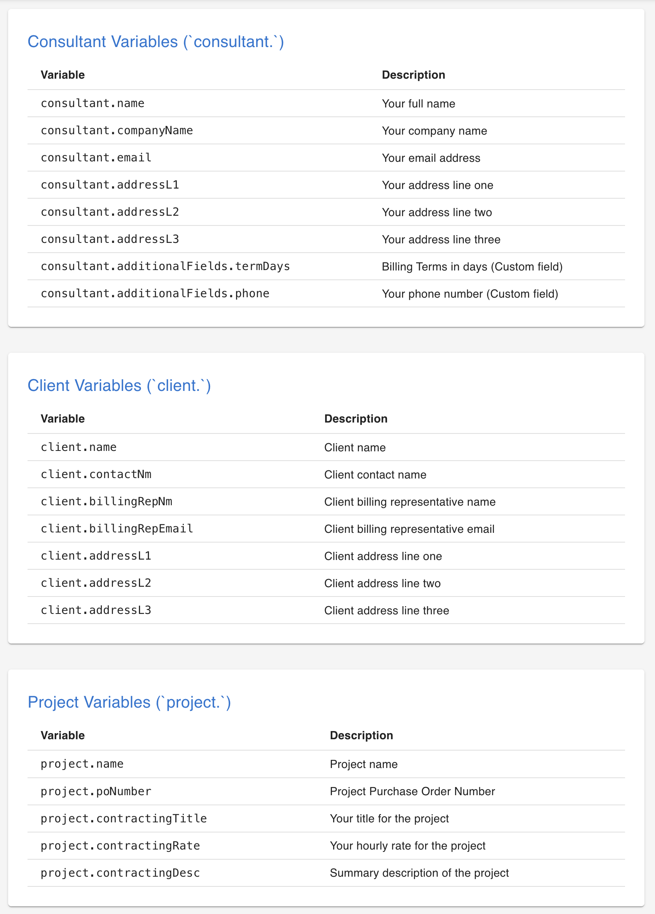
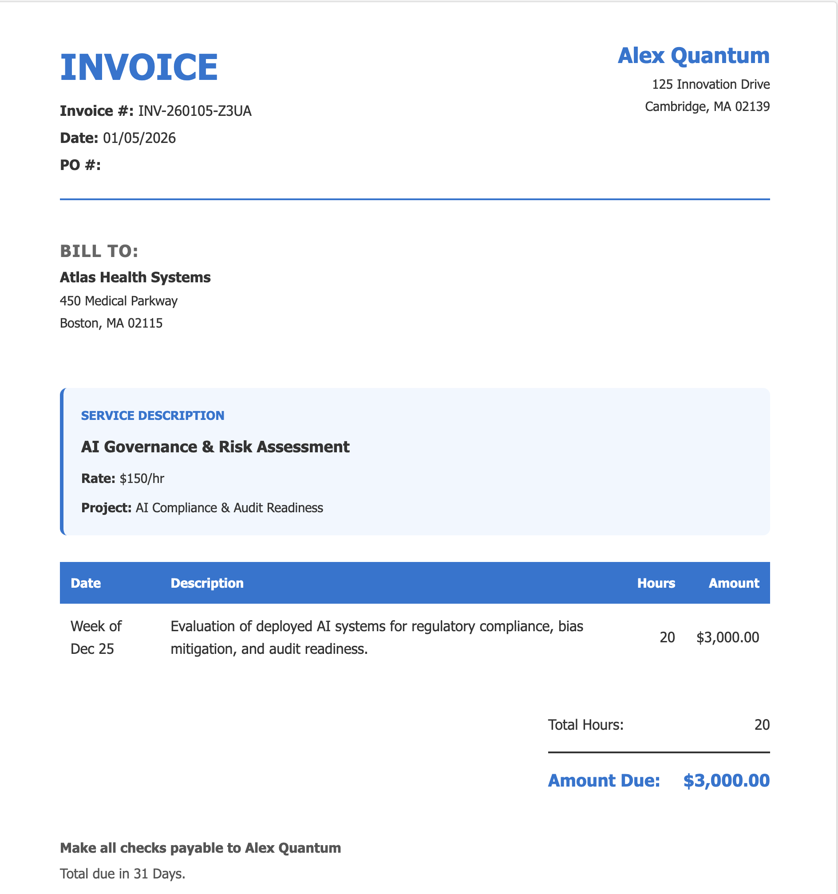
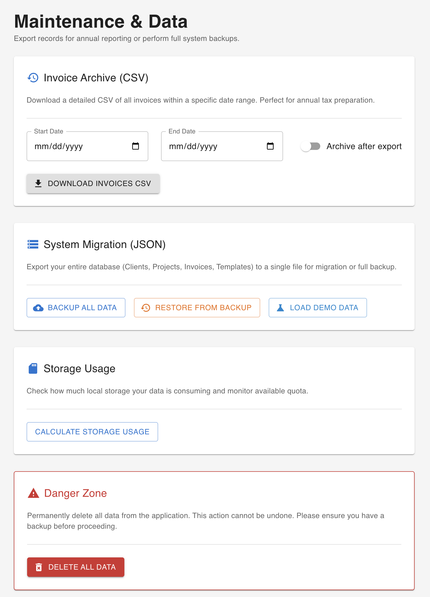

# SoloBill

<div align="center">
  
  <br>
  <em>A Lightweight, Offline-First Invoicing PWA for Consultants</em>
</div>

---

## Overview

**SoloBill** is a **Progressive Web App (PWA)** designed to simplify invoicing for independent consultants. It allows you to manage clients, projects, and invoices efficiently.

* **Installable**: Can be installed as a standalone application on desktop or mobile devices.  
* **Offline-First**: Works **100% offline** after installation, ensuring productivity anywhere.  
* **Secure & Local**: All your data stays on your device; no cloud storage required.  

---

## Motivation

SoloBill was originally created to address a personal need for fast, flexible invoicing. It has been designed so that others—freelancers and consultants—can also benefit from a simple, reliable, offline-first invoicing solution.

---

## Key Features

### 📊 Dashboard
The **Dashboard** provides an at-a-glance overview of your consultancy business:

* Generated Invoices  
* Hours Worked  
* Revenue Billed  



---

### 🗂 Data Model
SoloBill uses a **simple but extensible data model**:

* **Consultant**: Your profile and business details.  
* **Client**: Your customers.  
* **Project**: Specific engagements with clients.  
* **Invoice**: Billing records for your projects.  

> **Note:** The app allows you to capture extra data using the **"Additional Information"** fields, where each entry is a Name/Value pair. These names can be referenced in templates to display the corresponding values on invoices.




---

### 📝 Invoices & Templates
* **Template-Based Generation**: Invoices, emails, and data exports are created using customizable templates.  
* **Admin Customization**: Upload your own templates to match your brand and style.  
* **Immutable Records**: Invoice data is **immutable**. Even if client or project details change later, previously generated invoices remain accurate, preserving historical integrity.



---

### 💾 Data Export & Backup
* **Full Backups**: Create complete backups of all data and restore them on other devices.  
* **CSV Export**: Extract invoice and project data to CSV for Excel or downstream accounting.





---

### 📧 Emailing
* **Current Integration**: Send invoices via your default email client using `mailto:` links.  

---

## Getting Started as a User

The latest release of SoloBill is available on GitHub Pages:  
[Access SoloBill Online](https://USERNAME.github.io/solobill/)  

You can **install it to your device** like any PWA:

1. Open the site in Chrome, Safari, or Edge.  
2. Tap **Add to Home Screen**.  

> To suggest new features or improvements, please open an issue or submit comments in the GitHub repository.

---

## Getting Started for Development

1. **Prerequisites**: [Node.js](https://nodejs.org/) installed.  
2. **Install Dependencies**:
    ```bash
    npm install
    ```
3. **Run Development Server**:
    ```bash
    npm run dev
    ```
    The app will be available at `http://localhost:5173` (or the port shown in your terminal).

---

## Potential Future Development

1. **Online Invoice Catalog**: Share and download invoice templates contributed by the community.  
2. **Multi-Device Syncing**: Keep your data synchronized across multiple devices.  
3. **Online Backups**: Optional secure cloud storage for your data.  
4. **Integrated Email Service**: Send emails directly from the app without relying on your local mail client.  

---

## Contributing

Contributions are welcome! You can:

* Submit Pull Requests  
* Open Issues for bugs or new feature requests  
* Suggest improvements to templates, dashboard features, or documentation  

Your help is appreciated to make SoloBill better for everyone.

---

*Built with React, MUI, and Dexie.js.*

---

## License

This project is licensed under the **MIT License**.  
